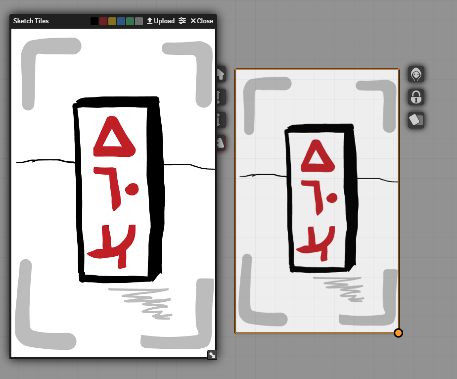
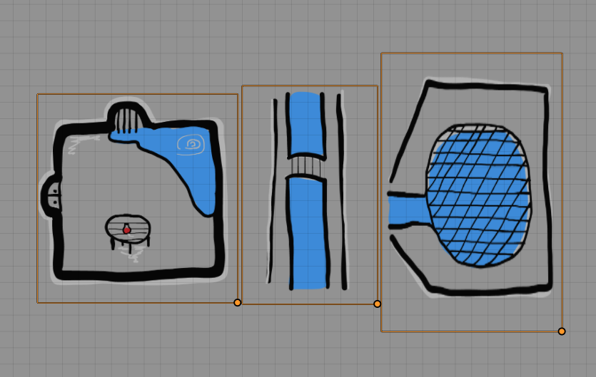
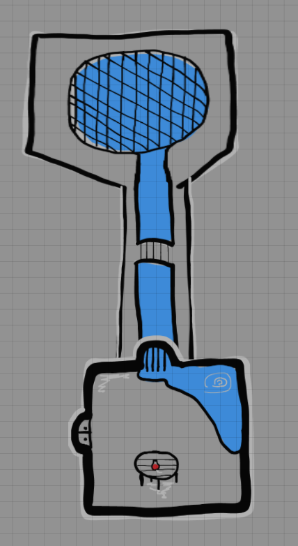
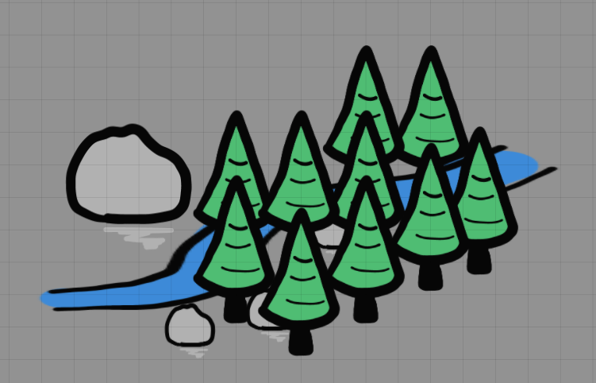
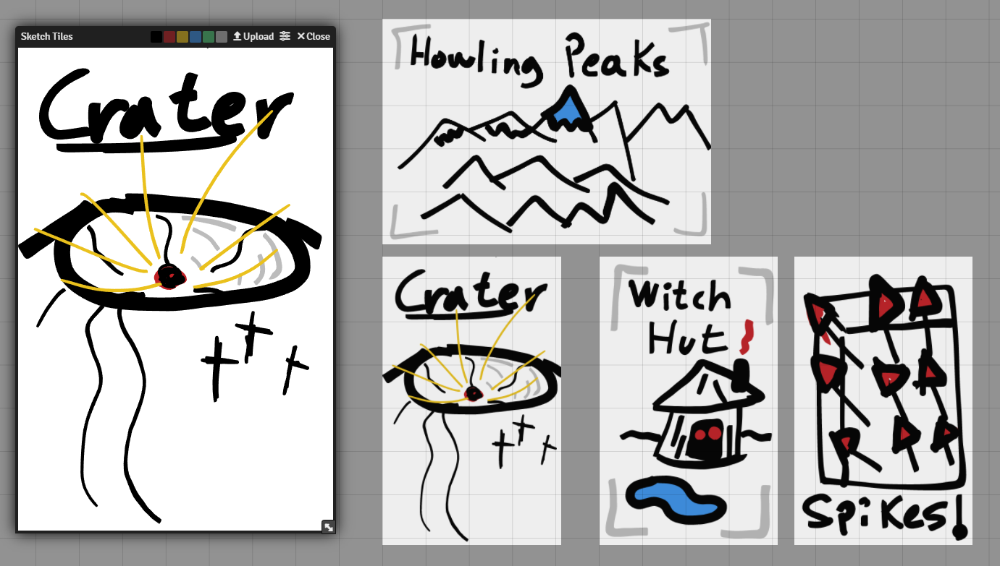

  

  Quickly sketch your ideas into the game! 
  A super light and system agnostic FoundryVTT Module.

<!--

  
Like the project?

  

-->

If you enjoy this module, consider supporting it!

  

## Why this module
Have you ever wanted to quickly sketch something pretty on the board? Or place some hand drawn dungeon tiles?
Hand drawn trees? Or maybe you are an improv GM and you wanted to make a quick room or some decorations?

Well this module has got you covered! Bring your creativity on the board by making cool and reusable hand drawn tiles!

Perfect for playing [Index Card RPG](https://github.com/ClipplerBlood/icrpgme) or zone based combat.

## How to use
A GM can create a new Sketch Tile by clicking the button  in the tiles control (3rd button on the left).

Then simply start drawing and when you are done, click the upload button to save it into the canvas!

If you want to edit a placed Sketch Tile, right-click on the tile and press the sketch tile button on the right.
A window with your sketch will open and then when you upload it again all tiles using this sketch will update.

If you want to customize the sketch settings (like colors, background and many more), you can click the settings button in the sketch tiles window.

### Controls
- Ctrl+Z: Undo
- Ctrl+Y: Redo
- Scroll Wheel: Change stroke size
- Left Click: Draw
- Right Click: Eraser

## Examples
Disclaimer: the following sketches have been made by a terrible sketcher, with a mouse and in 5 minutes.
If you want, send me your cool drawings on discord at ClipplerBlood#8146

<h3 align="center">Dungeon Tiles</h3>

  
  

<h3 align="center">Overland map</h3>

  

  Each element (tree, rocks, river) is a tile!

<h3 align="center">Index Cards</h3>

  

## How it works
All Sketch Tiles are SVG images. When uploaded, they are saved in `<FoundryData>/worlds/<world>/SketchTiles`. Then a new Tile is created with this file as texture.

The created tile dimensions are the same of the Sketch Tile window, so if you want to create a smaller (or bigger) tile
you can adjust the window size before uploading.

Note that in Foundry it is not possible to delete the files from the client (for sensible security reasons), so every once in a while you may want to delete your unused sketches to save a bit of storage.

## Issues and feedback
You can report issues directly on [github](https://github.com/ClipplerBlood/sketch-tiles/issues). If you have any questions or want to propose some features, feel free to message me on discord at ClipplerBlood#8146.

## License and acknowledgements
See [LICENSE](https://github.com/ClipplerBlood/sketch-tiles/blob/master/LICENSE) for further info.

Libraries used:
- [perfect-freehand](https://github.com/steveruizok/perfect-freehand)
- [SVG.js](https://svgjs.dev/docs/3.0/)

Thanks to Hertzila#5805 for the module name! And thanks to all the awesome foundry devs in the community for the feedback and help!

